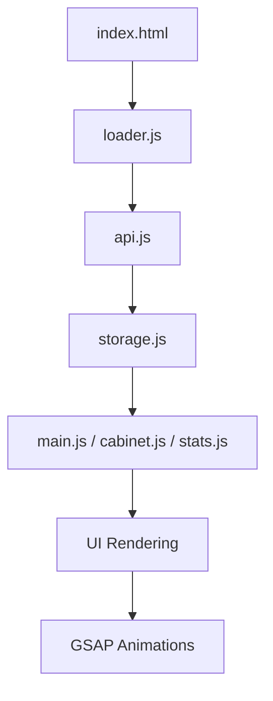

# 🛠️ GameStat.kz — Industrial-Grade Game Analytics Hub

> **Status:** SYNCHRONIZED // **Version:** 4.6.0 // **Theme:** High-Contrast Brutalist
> **Target:** AI-to-AI Documentation // Comprehensive System Map

---

## 1. Архитектура и Взаимодействие Модулей

Система построена на принципах модульного Vanilla JS без использования фреймворков. Это обеспечивает максимальную производительность и полный контроль над жизненным циклом приложения.

### Схема взаимодействия (Flow)


### Назначение модулей (Deep Dive)
- **`api.js`**: Ядро данных. Реализует гибридную логику получения данных (CORS Proxy + JSONP).
- **`storage.js`**: Слой абстракции над `localStorage`. Управляет "Watchlist" и профилем.
- **`loader.js`**: Контроллер состояния инициализации. Блокирует UI до готовности данных.
- **`utils.js`**: Хелперы для форматирования строк, генерации ID и работы с DOM.
- **`main.css`**: Описывает дизайн-систему (CSS Variables, Grid, Mechanical Panels).

---

## 2. Движок Данных (API Engine)

Ключевая особенность — **высокая отказоустойчивость**. Система использует каскадный метод получения данных.

### Пример нормализации данных (`api.js`)
Любой ответ от внешних API (Steam или FreeToGame) проходит через функцию-нормализатор, гарантируя единый интерфейс объекта `Game`.

```javascript
function normalizeGame(g) {
  const strId = String(g.id || g.appid);
  const rating = g.metacritic || g.rating || (75 + (Number(strId) % 20));
  
  return {
    id: strId,
    title: g.title || g.name || "Unknown Asset",
    thumbnail: `https://cdn.akamai.steamstatic.com/steam/apps/${strId}/header.jpg`,
    genre: g.genre || "General",
    rating: rating,
    status: "SYNCHRONIZED" // Системный флаг
  };
}
```

### Обход CORS (Hybrid JSONP)
Для работы со Steam API напрямую из браузера используется JSONP через `allorigins.win`:

```javascript
function fetchJsonp(targetUrl) {
    const callbackName = 'gs_cb_' + Date.now();
    const script = document.createElement('script');
    const finalUrl = `https://api.allorigins.win/get?url=${encodeURIComponent(targetUrl)}&callback=${callbackName}`;
    // ... логика ожидания и очистки скрипта
}
```

---

## 3. UI-Система: Industrial Brutalism

Дизайн имитирует технический терминал. Основные элементы — жесткие сетки, моноширинные шрифты и "механические" детали.

### Дизайн-токены (`main.css`)
```css
:root {
  --bg: #050505;        /* Глубокий черный */
  --accent: #ff3c00;    /* Электрический оранжевый */
  --font-mono: "JetBrains Mono", monospace;
  --radius: 0px;        /* Только острые углы */
}
```

### Компонент "Mechanical Panel"
Панели имеют декоративные углы и имитацию крепежных винтов.

```html
<div class="mechanical-panel">
  <div class="corner-tl"></div> <!-- Top-Left Screw -->
  <div class="corner-tr"></div> <!-- Top-Right Screw -->
  <div class="panel-head">
    <span class="ui-label">DATA_STREAM: 0x4F2</span>
    <h1>CONTENT</h1>
  </div>
</div>
```

---

## 4. Состояние и Персистентность

Система использует `localStorage` как "бортовой самописец". Ключ: `gamestat_watchlist_v1`.

### Логика Watchlist (`storage.js`)
```javascript
function addWatchlistEntry(entry) {
  const list = getWatchlist();
  // entry содержит { id, gameId, addedAt, status: 'TRACKING' }
  list.push(entry);
  localStorage.setItem("gamestat_watchlist_v1", JSON.stringify(list));
}
```

---

## 5. Адаптивность и Breakpoints

Интерфейс спроектирован по принципу "Grid-First".

- **1600px+**: Тройная сетка (Sidebar | Main | Stats).
- **1200px**: Переход к `grid-template-columns: 1fr`.
- **768px**: Мобильная оптимизация. Заголовки уменьшаются с `5rem` до `3rem`, карточки занимают 100% ширины.

### CSS адаптация примера:
```css
@media (max-width: 768px) {
  .card-grid {
    grid-template-columns: 1fr; /* Стек вместо сетки */
  }
  .brand {
    font-size: 2.5rem; /* Уменьшение логотипа */
  }
}
```

---

## 6. Жизненный цикл (System Boot)

1. **`loader.js` (DOMReady)**: Создает оверлей, запускает имитацию загрузки системных модулей.
2. **`api.js` (Start)**: Запускает `startBackgroundHydration` каждые 4 секунды для наполнения кэша.
3. **`main.js` (init)**: Подписывается на событие `archive_updated`. Как только данные получены, рендерит сетку через `utils.renderGrid()`.

---

> **Note for AI:** Данный проект является SPA-подобным приложением на чистом JS. Он не требует серверной части (кроме статического хостинга) и полностью автономен. Оптимизирован для работы в условиях плохой связи благодаря агрессивному кэшированию и фоновой гидратации.
